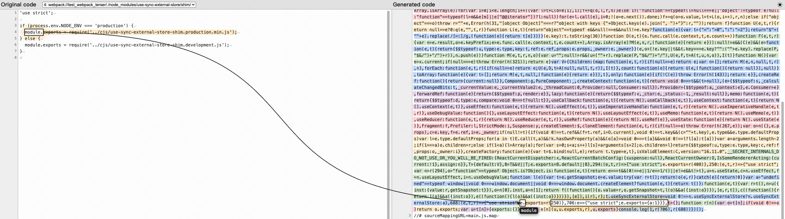
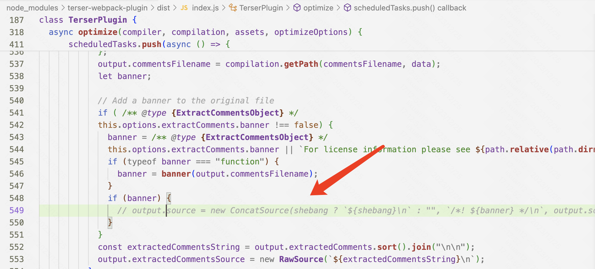
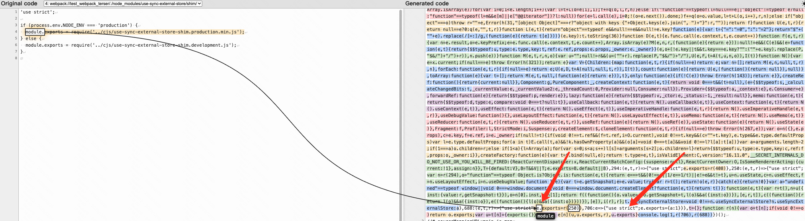

# Reproduce Steps

- run `yarn build`

- use [Source Map Visualization](https://evanw.github.io/source-map-visualization/) to analyze source-map

Find `a.json` is mapped to `use-sync-external-store` incorrectly.

# Workaround

- modify `node_modules/terser-webpack-plugin/dist/index.js` and comment follow line:

- run `yarn build`

- use [Source Map Visualization](https://evanw.github.io/source-map-visualization/) to analyze source-map

Find `a.json` is no-source, this is expected.

